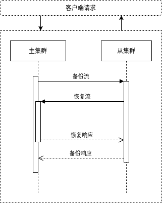

## 方案架构



1. 从集群定期执行backup工具, 增量式备份主集群的volume数据.
2. 主集群发生故障, 此时启动从集群中的master服务 + volume服务, 启动前先设置从集群上所有的volume为只读状态, 最后将用户流量导入从集群. 之后如果有新增对象需要存储, seaweedfs会新建volume来存储新对象. 
3. 主集群恢复正常, 此时在主机群中执行backup工具, 拉取故障期间内新增的对象, 然后关闭从集群, 再启动主集群, 最后将用户流量导入从集群.

## 使用指南

### 1. 部署

将backup工具拷贝至主从集群所有的机器上, 并添加至$PATH.

### 2. 执行

#### 2.1 定期备份主集群的volume数据

所需状态 = 主集群正常服务 + 从集群正常关闭

在从集群机器上定期执行如下指令:

1. 找出leader节点

```shell
curl "http://10.0.2.15:9333/cluster/status?pretty=y"
```

返回为

```json
{
  "IsLeader": true,
  "Leader": "10.0.2.15:9333",
  "Peers": [
    "10.0.2.16:9333",
    "10.0.2.17:9333"
  ]
}
```

可知leader节点为10.0.2.15

2. 执行backup工具

```shell
backup -master_http=10.0.2.15:9333 -master_grpc=10.0.2.15:19333 -dir=/mnt/locals/seeweedfsvolume/volume0/volume
```

命令参数说明:

```text
master_http : 主集群leader master的HTTP服务地址
master_grpc : 主集群leader master的GRPC服务地址
dir         : 备份集群上seaweedfs volume pod挂载的磁盘目录
replication : 副本参数, "000"表示备份volume只有一个副本, "001"表示备份volume在一个机架内有2个副本, "010"表示备份volume在不同机架有2个副本
```

#### 2.2 主集群发生故障, 切换从集群

所需状态 = 主集群宕机 + 从集群正常服务

在从集群机器上执行如下指令:

1. 将所有volume设置为只读状态, 此步骤是为了区分备份的数据与新添加的数据, 方便后续同步新增的数据回主集群

```shell
chmod 444 /mnt/locals/seeweedfsvolume/volume0/volume/*
```

2. 在从集群上启动master服务 + volume服务

按照部署方式视情况而定

#### 2.3 主集群恢复正常, 同步故障期间内新增的数据

所需状态 = 主集群恢复 + 从集群正常服务

1. 关闭主集群服务

2. 在主集群机器上执行如下指令:

```sh
# 如果主集群中每份对象数据有2个副本, 那么需要同步数据至2台机器, 在主集群中选定2台机器进行操作
# 假设从集群的leader节点为10.0.2.18
backup -master_http=10.0.2.18:9333 -master_grpc=10.0.2.18:19333 -dir=/mnt/locals/seeweedfsvolume/volume0/volume -skip_read_only=true
```

命令参数说明:

```text
master_http    : 从集群leader master的HTTP服务地址
master_grpc    : 从集群leader master的GRPC服务地址
dir            : 主集群上seaweedfs volume pod挂载的磁盘目录
replication    : 副本参数, "000"表示备份volume只有一个副本, "001"表示备份volume在一个机架内有2个副本, "010"表示备份volume在不同机架有2个副本
skip_read_only : 不同步只读状态的volume
```

3. 数据同步完毕后, 恢复从集群所有的volume为可写状态

```shell
chmod 644 /mnt/locals/seeweedfsvolume/volume0/volume/*
```

4. 关闭从集群, 启动主集群
